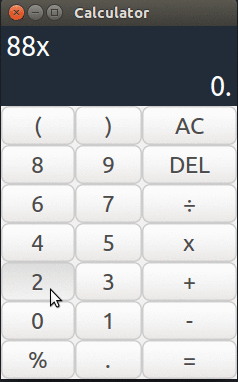

<h1 align="center">Calculator made with PyGTK</h1>

    

GTK+, python and css are the amazing combo.

## Requeriments

-  `PyGTK+` version `3.x`.
-  `python` version `2.7`.

## Installation and usage

1.  Clone the repo.
2.  Run the file with `./main.py`.
